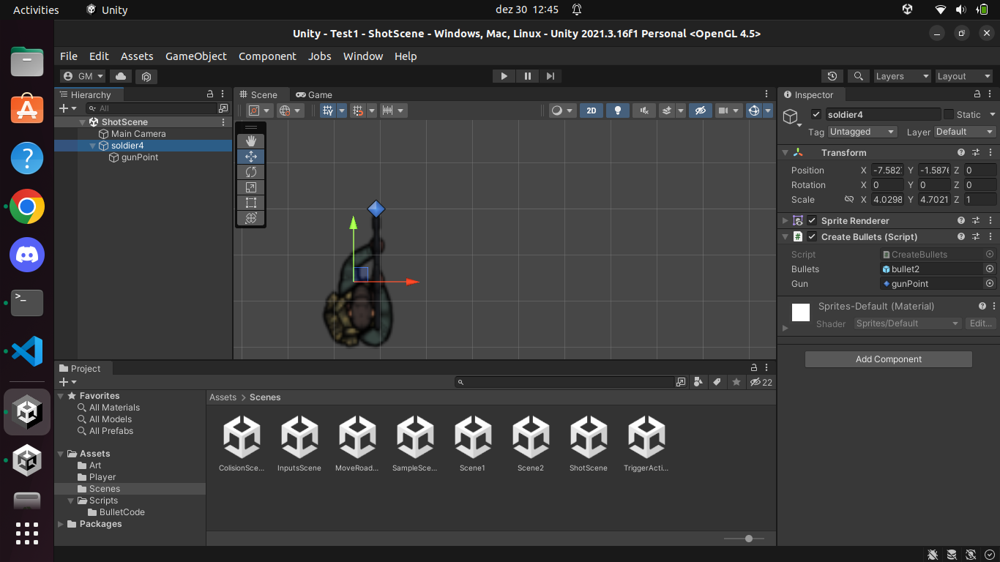

# Unity Study

Created by: Gustavo Vinicius

```sh
Unity Editor version is 2021.3.16f1 Personal OpenGL 4.5
UnityHub version 3.4.1
```

### For Ubuntu version 22.04
```
sudo apt install libssl1.0-dev
```

### Add script to object
```
Create the C# script at the Assets footer bar.
Write the code as follow.

To add the code to the game object, select the game object
click at the Add Component button, select Scripts option
and then select your desired script.
If you put your scripts attributes with public view
you will be able to drag the game objects to the attributes
to use them inside your script.
```

### Move object code
```c#
using System.Collections;
using System.Collections.Generic;
using UnityEngine;

public class FasterInputMove : MonoBehaviour
{
    private float speed = 2.5f;
    
    // Start is called before the first frame update
    void Start()
    {
        
    }

    // Update is called once per frame
    void Update()
    {
        if (Input.GetKey(KeyCode.RightArrow)) {
            transform.Translate(new Vector3(speed * Time.deltaTime, 0, 0));
        } else if (Input.GetKey(KeyCode.LeftArrow)) {
            transform.Translate(new Vector3(-speed * Time.deltaTime, 0, 0));
        }
    }
}
```


